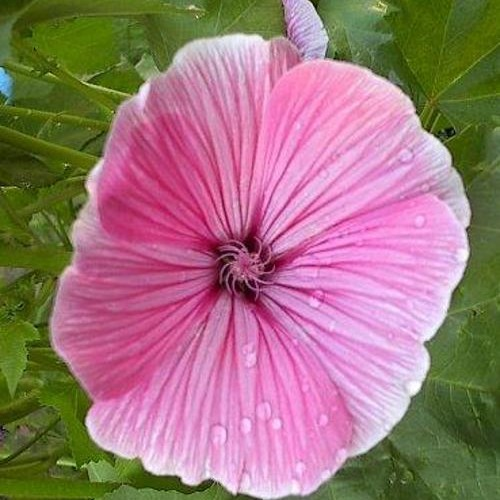
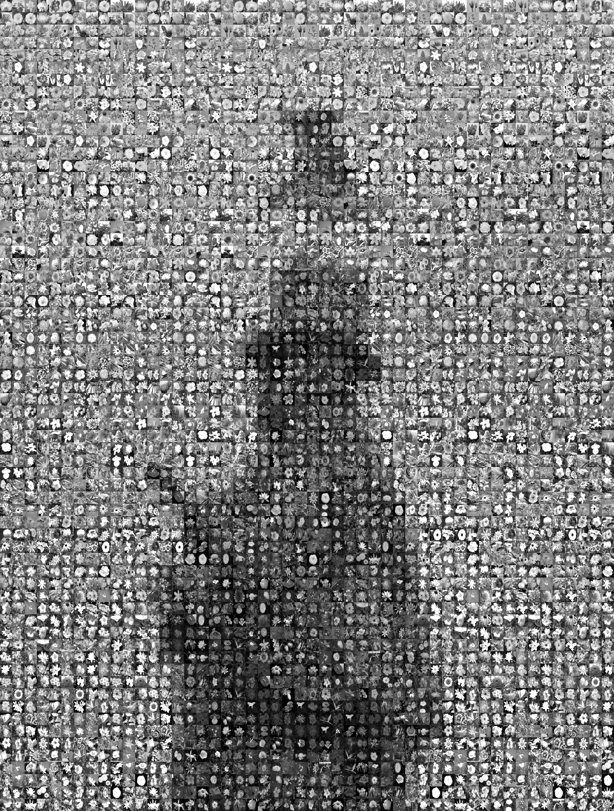

# 🖼️ Photomosaic Generator (MATLAB)

Treat your loved ones with a photomosaic made from their favorite pictures, which will form a new image.

This MATLAB project generates a **grayscale photomosaic**, where many small tile images are arranged in a grid to form a new image. 
Each tile is selected based on brightness to best match a region of the target image.

---

## 🧩 Example Result

📝 *In this example, the tile images were taken from the* **[Oxford 102 Flower Dataset](https://meta-album.github.io/datasets/FLW.html)** 

Example of tile image:

<p align="center">
  
</p>

And a target image:

<p align="center">
  
</p>

The output photomosaic will look like this:

<p align="center">
  
</p>

---

## 🚀 How to Run

### 1. Install MATLAB

If you don’t have MATLAB, install it using the official guide:  
🔗 [Install MATLAB](https://se.mathworks.com/help/install/ug/install-products-with-internet-connection.html)

---

### 2. Set Up the Project

- Clone or download this repository.
- Open the project in **MATLAB**.
- Inside the project directory, create a new folder called: **tiles/** and fill it with images
- Inside the project directory, add the target image that will be tiled out of images as target.jpg
- Add your tile images into the `tiles` folder:
- Tiles must be **square** (e.g., 100×100, 64×64, etc.).
- They **can be of different sizes**, but each must be square.
- All images will be automatically converted to **grayscale**.

---

### 3. Configure Mosaic Settings

Open `generateMosaic.m`, and **modify these parameters** to adjust the mosaic size:

```matlab
% Please choose the correct side ratio here
numCols = 20;                     % Number of columns in the photomosaic
numRows = floor(numCols * 1.5);   % Number of rows in the photomosaic
```

You can also change the output filename:

```matlab
outputFilename = 'photomosaic_output.png';
```

### 3.  Run the Script

In MATLAB, simply run: generateMosaic.m
The generated photomosaic will be saved in the project directory using the filename defined in outputFilename.

---

## 📜 License
This project is open-source. Use it freely for personal or academic purposes.
